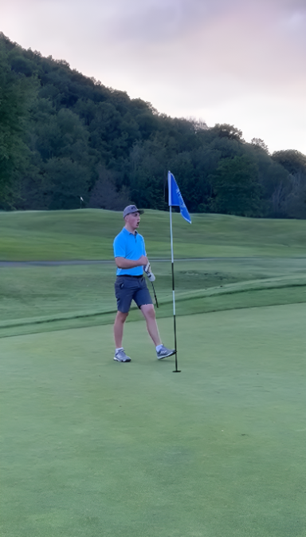
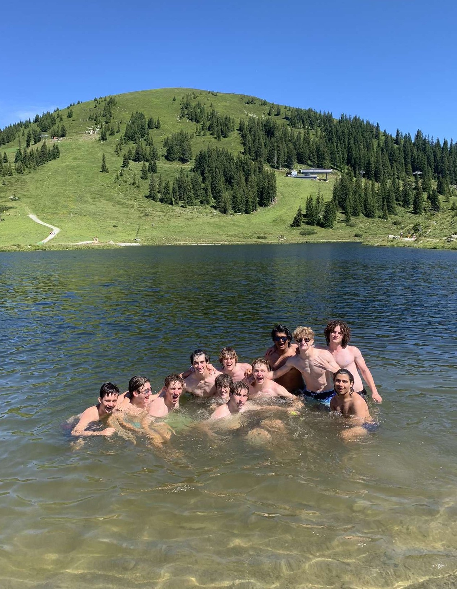
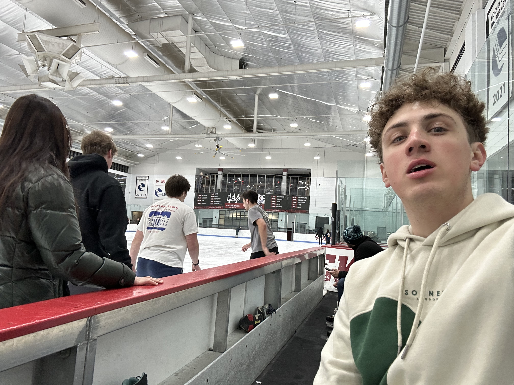
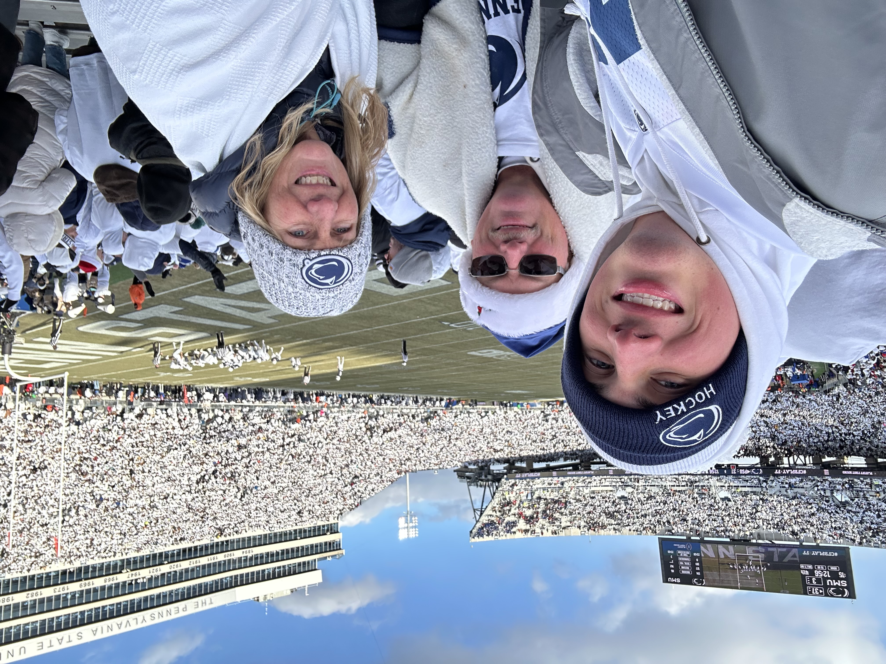

# Austin Fairbanks

## About Me
Hey there! I'm Austin, a Computer Science student at UMass Amherst with a deep passion for data science and machine learning. Beyond the code and algorithms, I'm just a regular guy who loves to stay active and explore the world around me.

On weekends, you'll often find me hiking trails around Massachusetts - there's something incredibly refreshing about disconnecting from technology and reconnecting with nature. I've recently gotten into golf (still working on my swing!), and I'm always down for a pickup volleyball game with friends. The gym has become my second home, not just for fitness but as a way to clear my mind after long coding sessions.

I'm a huge sports fan, especially when it comes to Penn State football - you'll find me decked out in blue and white on game days, cheering on the Nittany Lions! There's nothing like the electric atmosphere of a packed stadium, and I try to catch as many games as I can each season.

Spending quality time with friends and family is incredibly important to me. Whether it's weekend barbecues with my family, movie nights with friends, or just catching up over coffee, these moments keep me grounded. My friends often joke that I'm the designated planner of the group - always organizing get-togethers and making sure everyone stays connected despite our busy schedules.

Music is a huge part of my life - I can't code without my playlist running in the background. Daniel Caesar's smooth vocals, SZA's incredible range, Milkzy's chill beats, and Steve Lacy's unique sound are my go-to artists when I need to focus or unwind. I'm also a bit of a bookworm and try to balance technical reading with fiction to keep my imagination alive. When I need to completely disconnect, nothing beats a few hours of gaming - though I have to be careful not to let that eat into my project time!

## Education Journey
I'm currently working toward my Bachelor's in Computer Science at UMass Amherst (class of 2026), with plans to continue straight into an accelerated Master's program focused on Data Science (graduating in 2027). 

My coursework has been challenging but incredibly rewarding. Taking CS 311 (Algorithms) really changed how I approach problem-solving, while CS 389 (Intro to Machine Learning) confirmed that data science is where I want to focus my career. I'm particularly excited about continuing my Hyperparameter Optimization research as a self-directed project during my senior year - it's amazing how much this niche area impacts model performance!

## Personal Growth
Working as an Intramural Manager at UMass RecWell has taught me more about leadership than any classroom could. Getting promoted as a freshman was a big deal - it rarely happens! The role has thrown me into situations where I've had to resolve conflicts between competitive players, make quick decisions under pressure, and lead teams of referees who are often older than me. These experiences have made me more confident and taught me how to stay calm when tensions run high.

I've got an exciting data science and machine learning internship lined up for Summer 2025 that I can't wait to dive into. It feels like all my hard work is starting to pay off, and I'm eager to apply what I've learned in a real-world setting.

## What Drives Me
I'm fascinated by how data science can uncover patterns and insights that aren't visible on the surface. My RateMyProfessors analytics project started as a curiosity but has evolved into something that could genuinely help students make better decisions about their education.

Beyond technical achievements, I value connections with people. Whether it's collaborating on projects, mentoring newer CS students, or just having deep conversations about where technology is heading, I believe that the human element is what gives our technical work meaning and purpose.

In the future, I hope to use my skills to work on projects that make data more accessible and useful for everyday people - because at the end of the day, technology should serve humanity, not the other way around.

## My Hobbies

When I'm not coding or studying, I love to spend time outdoors. Golf has become one of my favorite hobbies recently - there's something therapeutic about the focus it requires and being out in nature.

Traveling is another passion of mine. I try to visit new places whenever I can, as I believe experiencing different cultures and environments broadens your perspective and inspires creativity.

Winter sports are a big part of my life too. Ice skating has been a tradition with friends since last winter. It really helps take the mind off of school work for a while.

As I mentioned, I'm a die-hard Penn State football fan. Game days are sacred - the energy, the traditions, and the community feeling make these experiences unforgettable. WE ARE!

